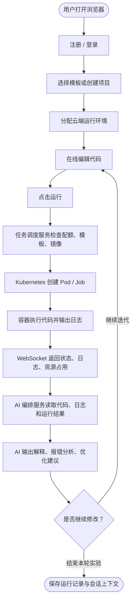
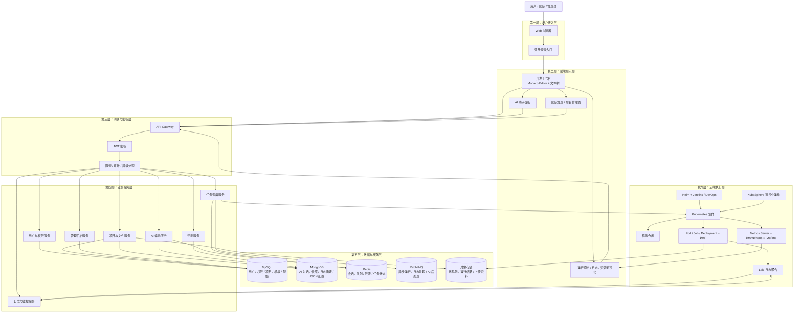
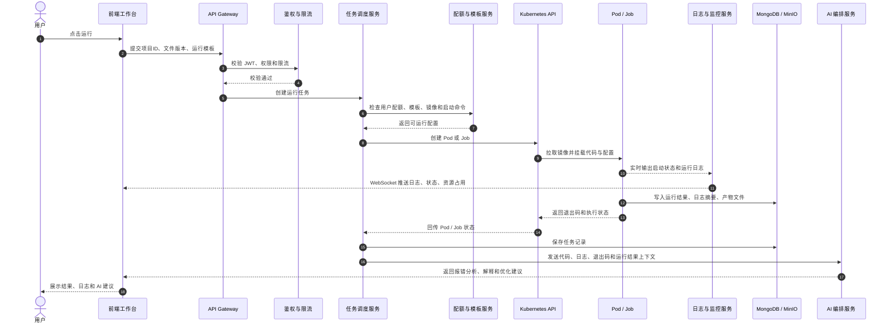

# 码瑙 PRD v4.0 图表稿

本文根据 `Manao_PRD_V4-0.md` 整理，包含产品闭环流程图、系统分层架构图和运行任务时序图。

## 1. 产品闭环流程图

MCP 渲染预览：
https://mermaid.ink/svg/pako:eNpVkstu2kAYhfd9itGs0gXKG1RKQi5AElVqpS6sLEpCValVkVKqLqpKdmnAONwSwIFyi4MI7gUTqUoKtokfBv8z41VfoWLGrdTNt5hzzvxHM_-L1-n3hy-fH2fQ0-gDhBBaW5EwrZtE_UUKNXBlclthIxVaJj54yA3rEiY_TcgV0SqiLQfmDXzAhQ0JB3KBnH4lpkG6HlF1UNvg2IExo20rNEUlDGouOCn59hn9PmFelRlFWp7AVTZ0bEoYOia1Perq7P7Mdwb0Ugm1LQnTTzPIOyIXnm5L2Hcc0Ax2kwX7mnRKoBlkIJP-MDgpBVfdhayITgtZCRodyFbC5I6EE--SqeM3qUzqLRJ10eP0EVpF8XQyNMUkDNYMWiYpjJhRFIVgdsfua5C3ycUQvIvQGpfws1TySfrwVSqDmFeHdo9qd0RWlg24cSEr7PYzsatQuqR1M8wlJLwWQ9TVSflc1GcTByq6mPUvDOfF8MGcGul1wvAuD4s2bDQI8toyoA2DegvUHOlVF7Liu00o6uDYzPr7E3sfMGlOoHpNnRF1xr5nkfrst9vHH7m8vyJh3-vCuClGMusG5g1_WvbdL2zS9aeaPz0len65FmJxUCTyCK1zbnBGOTc5tzi3OXc4Y5xxzgTnLueeaIciEYRFNeaNfWeAxW3_qTXS7ZPODza3wOoF34rCs_8Hd7tm_A

## 2. 系统分层架构图

MCP 渲染预览：
https://mermaid.ink/svg/pako:eNqFVV1T2lgYvs-vOJMrd5wOs5_j1c7o6nRRWVF0vQi9CHAqrJI4Ieh45xeuUuRjrVZFtsZqcccqOq2WAi5_JuckXO1f2DnnBEwkbbkgyfs-583zfj15PicvhqOiooLJAQ4AAKYE3nh5jjc_Ag9AxZPW_mvgAcaVZuQ3UGGff8ZRVCIZmlHE-SgY_VbgjXfv9Ooyuln9r3HIzuLsGUqdoZtV_hmFk9-AIi8moCLw0zAE8G3OLG-ig3MboD-pRockVVkSePz-HG1kjIM6ut8lgXJvLByUIo8JfMcI1DKMANraNi4q6GbXOK05CUzLymwISuGowKPGMsoV0Mcz_f4I5a6Dkk-WxLAMhiIxVVZAL8B7f-r1O3xcsPPz-kUJzgl8vxeg9D9460WrdIJLTRtkIilZGLOZN7UMzpbR5h3wAPzqDDVfAQ8wb9dxLY9yFbO8gTJ79vCReEya8go8qzorOWlCPoty1-yxpd1-vhDfW53YsjpxX0Cp93o129r6gEtrzlo8FVW4KC4JfL_f236wuYenJwV-eHoSsLP2DEUVjsbiMVXgWwd5fLtCGF5p5pVGbhqrqFpFp-tGfuPzPH-gPFGxyHjq1UOU1vDRNkprTpJTCagEFsLtgdSrWVxaI2-lWBvQr8h_wLBKsS3tk1G8IljWwsfYfi-F9XuB0djD2b-6AJNiYpZC9HodpTXzeg3V3nahhhbEOYoyK-v49kWXf1SeoW7WeL2aNYoFnC134XwzccbbWjHabAfKpYI_WiP_klUQ717jbZKy0dhBl_vOIvqWAuOjQg9Pr0Gps9uslMADWMGI5VzDpSaxpLZbJyX-G1sQWZqRSRByHRwISmQFKp_MSol0vXlhpMqdIceFffMtGYvhwNhvJJZxf2WPNQEjsYTQw9NrUNIbhyxMa_812iQr0pkr1gAjfYeXVxxsxslxMRSKqb7xoIQaq_jyjC1chwUbQuABhGk-a82kLchYICD08CSJG40UbfU8KOn1N8bxCsqkyKLSeEZ9B_99RLhU03rjmGzv3kE7jEtnfmKznbq0ZrtWMC4qeKtsahlnWybgTCxBta61e4TWcnp9B9V2bICRvoDAjyRDUJGgChOgVdww_j21D70cEXi_HCGVlkPAAwbh_Jy8FIeSCnqB__dfeEf_iLAJvA-qSiycAAGoLEAidH5FjkM1CpMJ0AueKuJzURIdYzwbE3jyb9XVXDlE-U0bYhAujM0nBP5XOBcHvWAYSrMxKUHpEIc9o2QIBuajUIEsMXYPOlpoNvNG_cPjqZ8CT5783P540PvOd4I-dVSdc2g8QzLFdvG0hdrtENNhF4-lk5ztY9BlbwfuPsDCdtmte2onikvZtUWWc0gu9Vmi6OJ5UEEXJ5U9F7uldi4eS-FcPEzbXByWmFmNY0SZg4gP55TqrziI0rg5xgIBrqPjj6APNiounE3Ov2D1jXM2RX8UkuVqpT0b42yabUugK-ZIH2M50hew3szW3WH0yxHO2mRHau3nzgvbB6w15h72zvmyh6Wym61T3XNP1_qhof8DCH_T3w

## 3. 运行任务时序图

MCP 渲染预览：
https://mermaid.ink/svg/pako:eNp1k9tOGlEUhu_7FPsFJt6auZiERiUUTWmw4XrACSVGxsKQpnczUuXgcBRRyqFQRegJbVIRQcrDMGsP8xbN3ptTSryaTPa31r_2_68dlt5HpKBP2giI_pB48AIhhMSIIgcjB14pxH59ihxCb8NSCIlhZBbaOP5ADw7FkBLwBQ7FoIK2NskhJFLmj1t4aBrDCmTuVii7h1A2lwPZRUX6IH5cIWwR5R1hrMQfXI0avbRVyuJ7bYXbFcP7hDMGA0g2JndR6N_gSgqSjRX0TURWRNrzOGV9rRq9NG43cHX0DO5cdxPYGfFKoaCkSHTeFcol7xGKfNbQK9m7AmzLfgLgiyaMLoxe2izncLr1jKZbkUMSwXfkoF_eeInW0E4g6Hi9ao-DGuhA5lMRp_PTdhQjAXGCsLXJI_PoEWKDySg7aej0bGuTEwS7h0c4kzX611bj0Sx3HBtjVcPFmDHomok4rvwcqxqrYf7QSruHEwQSCo9wvWF919Erzy6pq0atUhby-lI-BONmQhS21M-TUWzRiKTGI4iXYdBnUiw_SpBDThBoXDzCVyr-0mTbxoIjqnSwsapZ5xWIZiCvQ_YWkm3IDY3BNe1Cy7m51mRUgHINMrdMzjpOmcPOspxz3T2biKaJ48V5ns51NycILnmPR_g0AZniVPaxi_WjyXBoDK7MukaWdNHWJe8R9W3ZzyPo1PBFd_L3DGJ9NqiZ7GJVg7w-NZpuB63blv3cND6P5HXLvn1JQTjdtlSNUWNVY9UkpvtPuJ-FVN0stOeqgkDXiEdwUoLjJlMwB2e4VhnPmuDc5eSGdDD6LTPxjaW_PDe1g5lmqSrE-madjIsTLdKM6s-tWQRarhlP9cVjQEvg1ObpaMaoCr8up4-2cwfD82XI5uARZHKWqjFnx0t3X55m-WpGL2n0TnGRbZnNMTOR3QEnm1ahBPETXMsS31pXViwJed14ugS9SLaw05m9EE4QyBviEfw-N6_7_zkHeZ28O1byD29MhqA

